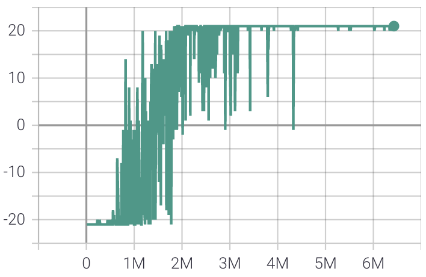

# dqn
Implementing Deep Q Networks (DQN) from scratch, using pytorch. I wrote a Medium post (Towards Data Science publication) describing my process,
learnings, and results: https://towardsdatascience.com/learnings-from-reproducing-dqn-for-atari-games-1630d35f01a9.

## Installation
1. I use the Poetry package manager. If you don't already have Poetry installed, see their docs for instructions
(https://python-poetry.org/docs/master/). E.g. for a macOS, it just amounts to running
`curl -sSL https://raw.githubusercontent.com/python-poetry/poetry/master/install-poetry.py | python -` in terminal.
2. To install this `dqn` repository: git clone it, then navigate to the root directory and run `poetry install`.
3. To get the Atari envs working, you'll also need to follow these short instructions to download and import the Atari
ROMs: https://github.com/openai/atari-py#roms
4. Test by running unit tests! Run `pytest` in the root directory.

## Results
I tested this DQN implementation on some classic benchmarks (CartPole and FrozenLake) and some Atari games as well 
(Pong, Freeway). Here is a summary of the results (check out [my Medium post](https://towardsdatascience.com/learnings-from-reproducing-dqn-for-atari-games-1630d35f01a9) for full details).

### CartPole

  

(Left) Mean of 10 training runs on CartPole. Error ribbons, indicating 1 standard error, are in red. (Middle) A 
representative training run, where x-axis is number of env steps, y-axis is mean episode return over 100 evaluation
episodes. (Right) Gameplay of a fully trained agent, whose goal is to move the cart so the pole stays balanced without
toppling. (Image and gif source: author)

### FrozenLake

  

(Left) Mean of 10 training runs on FrozenLake. Error ribbons, indicating 1 standard error, are in red. (Middle) A 
representative training run, where x-axis is number of env steps, y-axis is mean episode return over 100 evaluation 
episodes. (Right) Gameplay of a fully trained agent, whose goal is to navigate from the start position S to the goal 
position G by walking through frozen spaces F without falling into hole spaces H. The catch is that the floor is 
slippery and the actual step direction can be randomly rotated 90° from the intended direction. The agent’s input 
direction for every step is indicated at the top of the screen. (Image and gif source: author)

## Pong

  

(Top) Three training runs on Pong, where x-axis is number of env steps and y-axis is episode return of a single 
evaluation episode. (Bottom) Gameplay of fully trained agent (green player), whose goal is to hit the ball past 
the opponent’s paddle. Here, I added a small amount of stochasticity (10% chance of random action) to show how 
the agent deals with a more varied range of scenarios. Without the added stochasticity, the agent beats the opponent 
in a very similar way each time. (Image and gif source: author)

## Freeway

  

(Top) Three training runs on Freeway, where x-axis is number of env steps and y-axis is episode return of a single 
evaluation episode. (Bottom) Gameplay of fully trained agent (left-side player), whose goal is to direct the chicken 
across the road as quickly as possible while avoiding cars. (Image and gif source: author)
